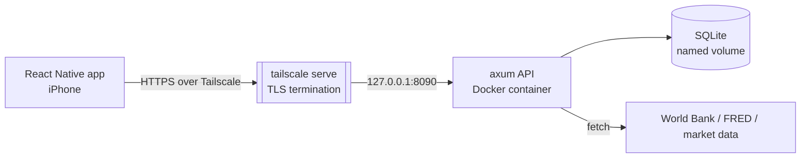

# Trading Journal

[](https://github.com/chris7ran/trading-journal/actions/workflows/ci.yml)
[](LICENSE)
[](code/backend)
[](code/mobile)

A **self-hosted, single-user trading journal** for iOS —  owned end-to-end, and running on my own hardware for **€0/month**.
Log trades, analyse performance, track prop-firm rules, follow the macro calendar,
and review your own trading psychology — all behind a private VPN, no public port,
no third-party cloud holding your data.

> Built as a full-stack + infrastructure project: a **Rust/axum** API, a
> **React Native/Expo** mobile app, and a complete **self-hosting pipeline**
> (Docker, CI/CD, Tailscale HTTPS) — from `git push` to a phone in my pocket.

---

## Screenshots

<!-- Add PNGs to docs/screenshots/ and they'll render here. -->

| Dashboard | Trade log | Analytics | Macro terminal |
|---|---|---|---|
|  |  |  |  |

---

## Features

- **Trade journal** — manual entry or **MT5 CSV import**, per-trade screenshots,
  direction/PnL/emotion/setup, filtering and search.
- **Analytics** — win rate, risk metrics (expectancy, R multiples), performance by
  **setup**, by **time slot**, by **symbol**, and equity/health curve over time.
- **Setups library** — reusable trade models (e.g. reversal / opening-range) with
  per-setup performance rings.
- **Prop-firm tracker** — configurable drawdown / target rules to stay compliant.
- **Macro terminal** — economic calendar (impact-graded), key indicators
  (World Bank + **FRED** monthly US + Fed Funds), and live market data
  (gold, oil, US 2Y/10Y yields).
- **Coach** — post-trade reflection and performance-by-emotion breakdown.
- **Security** — password login hashed with **Argon2**, **JWT** sessions,
  biometric (Face ID) unlock, secrets in the device Keychain.

---

## Tech stack

| Layer | Stack |
|---|---|
| **Mobile** | React Native 0.81, Expo SDK 54, TypeScript, React Navigation, `expo-secure-store`, `expo-local-authentication`, `react-native-svg` |
| **Backend** | Rust, **axum** 0.7, **SQLx** + SQLite, Tokio, Argon2, JWT, Serde |
| **Infra** | Docker + Docker Compose, systemd, GitHub Actions (CI), **Tailscale** (WireGuard) reverse proxy with Let's Encrypt HTTPS |
| **Host** | Proxmox (Ubuntu VM) — runs on a mini-PC at home |

---

## Architecture



The API binds to **loopback only** (`127.0.0.1`) and is exposed to my devices via
`tailscale serve`, which terminates TLS with a real Let's Encrypt certificate on a
`*.ts.net` name. Result: end-to-end encrypted access from anywhere, **zero open
ports**, and no data leaving my control. Full write-up in
[`ARCHITECTURE.md`](ARCHITECTURE.md) and [`code/backend/deploy/README.md`](code/backend/deploy/README.md).

---

## Getting started

### Backend (Rust)

```bash
cd code/backend
cp .env.example api.env          # set JWT_SECRET + ADMIN_PASSWORD_HASH
cargo run                        # dev: API on 0.0.0.0:8080
cargo test                       # unit + integration tests
```

Or with Docker Compose (production-like):

```bash
cd code/backend
cp .env.example api.env
docker compose up -d --build     # persistent SQLite volume, healthcheck, auto-restart
curl -s localhost:8090/health    # {"status":"ok",...}
```

> **Note on secrets:** the Argon2 hash contains `$` characters, which Docker Compose
> interpolates. In `api.env`, **double every `$` → `$$`** so the container receives
> the literal hash. See [`code/backend/deploy/README.md`](code/backend/deploy/README.md).

### Mobile (Expo)

```bash
cd code/mobile
npm install
npx expo start                   # scan the QR code with Expo Go
```

At the login screen, enter your server URL (e.g. `https://<host>.<tailnet>.ts.net:8443`)
and password. The device must be connected to the same Tailscale tailnet.

---

## Repository layout

```
.
├── code/
│   ├── backend/     Rust/axum API (routes, MT5 import, migrations, Dockerfile, deploy/)
│   └── mobile/      React Native/Expo app (screens, components, typed API client)
├── sprints/         Iterative build log (sprint-NN.md) — decisions & trade-offs
├── ARCHITECTURE.md  System design (ADR-style)
└── .github/         CI workflow
```

## CI

Every push runs [GitHub Actions](.github/workflows/ci.yml): the Rust backend is
built and tested (`--locked`, hard gate), and the mobile app is type-checked
(`tsc --noEmit`). `cargo fmt` / `clippy` run as informative checks.

## License

[MIT](LICENSE) © chris7ran
